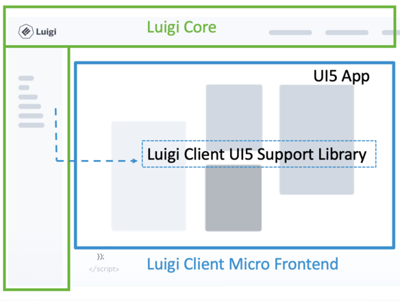

# Introducing the Luigi Client UI5 Support Library 

Project "Luigi" recently introduced the new Luigi Client support library for UI5. This blog post outlines its most important features and tells you a little more about Luigi. 

## Luigi and UI5 

[Luigi](https://luigi-project.io/) is an open-source micro frontend framework that comes with a fully Fiori-compliant design and other useful features out-of-the-box. Luigi's aim is to make it easier to adopt a micro frontend architecture for your web apps and make them scalable, modularizable, customizable, and consistent. **Luigi Core** allows you to create a complete web application, while **Luigi Client** lets you configure the views/micro frontends contained within it. 

One of Luigi's main advantages is that it is **technology-agnostic**, which means it supports apps built on any frontend framework. This includes [UI5](https://sapui5.hana.ondemand.com/), SAP's powerful web toolkit. Therefore, it has always been possible to use Luigi and UI5 together (you can find an example of an OpenUI5 app built with Luigi [here](https://github.com/SAP/luigi/tree/main/core/examples/luigi-example-openui5)). But now, combining the two is even easier thanks to the newly released Luigi Client support library, which provides helper methods for integrating UI5 apps as Luigi micro frontends. 

## Luigi Client UI5 Support Library 



The purpose of the new library is to make development easier by providing functions that can be used in your UI5 application. 

The Luigi Client UI5 support library offers the following features: 

* Context - allows you to receive a [context](https://docs.luigi-project.io/docs/navigation-advanced/?section=contexts) object from Luigi
* Auto routing - provides an easier way to keep your UI5 app and Luigi routing in sync
* Auto routing for modals - enables synchronization of routing between Luigi Core and a modal
* Preload - special view that can help you when using Luigi's [viewGroups](https://docs.luigi-project.io/docs/navigation-advanced?section=view-groups) feature

One of the scenarios supported by the library is that of auto routing. For example, say that you have built an app with UI5 with the URL `myUI5app.com` and you included it as a Luigi micro frontend in the navigation:

```js
navigation: {
  nodes: [
    {
      pathSegment: 'ui5app',
      label: 'My UI5 app',
      viewUrl: 'https://myUI5app.com',
        }
…
```

Your UI5 app may contain several pages which the user can navigate to, such as `https://myUI5app.com/about` or `https://myUI5app.com/settings`. Normally, this navigation wouldn't trigger a change in the URL of the main Luigi app because the two apps are independent. But with the help of the Luigi Client UI5 Support Library auto routing feature, you can synchronize the routing so that both URLs are updated at the same time. To use the feature, you would need to edit the `routes` definition of the manifest file in your UI5 app, and add the following: 
 
```js
{
    "pattern": "",
    "name": "about",
    "target": "about",
    "data": {
        "luigiRoute": "/myUI5app/about"
    }
},
{
    "pattern": "",
    "name": "settings",
    "target": "settings",
    "data": {
        "luigiRoute": "/myUI5app/settings"
    }
},
```

The end result should be that navigating to the page within the UI5 app also updates the Luigi route. There are other configurations of the auto routing feature available, for example one where Luigi's [virtualTree](https://docs.luigi-project.io/docs/navigation-parameters-reference/?section=virtualtree) is enabled. You can find more information about these in the UI5 Support Library [documentation](https://github.com/SAP/luigi/blob/710b4a0a7309a88b59eba4aa9ada849d85cf6776/client-frameworks-support/client-support-ui5/src/README.md). 

In conclusion, the Luigi Client support library can be useful if you are a developer who wants to create apps with UI5 and Luigi. Leveraging the power of both allows you to create apps which are flexible, scalable, and compliant with SAP and Fiori standards. For more information, you can read the documentation for [Luigi](https://docs.luigi-project.io/) or [UI5](https://sapui5.hana.ondemand.com/#/topic). If you have further questions, you can also reach the Luigi team on our [Slack channel](https://slack.luigi-project.io/) or [GitHub discussions](https://github.com/SAP/luigi/discussions) page. 

