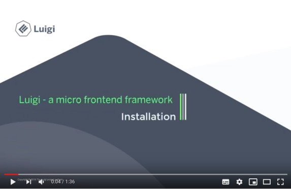

# Configuration

To configure Luigi:
- open the `luigi-config.js` file of your project
- add any Luigi parameters or functions you need

The small example file in your initial installation has four different sections: `navigation:`, `routing:`, `auth:`, and `settings:`, which correspond to the main parts of your app which can be configured using our Luigi **parameters**.

What do you want to configure?

## Luigi Parameters

| Navigation  |  Routing | Authorization  | Settings |
|---|---|---|---|
| Settings for individual nodes  | Routing parameters  |  Authorization | Settings |
| Global navigation settings |  | Third-party cookies  |  |
| Top navigation switchers, tabs, etc.|  |   Authorization events |   |

## Luigi API functions and additional options

If you want to create a more dynamic application, the simple static configuration in the initial `luigi-config.js` will not be enough. You can create a dynamic app by using the Luigi API functions.

#### Luigi Core

Luigi Core refers to the main application.

- [Luigi Core API](luigi-core-api.md)
    -   [Luigi configuration](luigi-core-api.md#luigi-config)
    -   [DOM elements](luigi-core-api.md#elements)
    -   [Authorization](luigi-core-api.md#authorization)
    -   [Navigation](luigi-core-api.md#luiginavigation)
    -   [Localization](luigi-core-api.md#luigii18n)
    -   [Custom messages](luigi-core-api.md#custommessages)
- [Lifecycle hooks](lifecycle-hooks.md)
- [UI Features](luigi-ux-features.md)
    - [Rendering Luigi in the DOM](luigi-ux-features.md#rendering-of-luigi-application-in-the-dom)
    - [Responsive settings for mobile devices](luigi-ux-features.md#responsive-application-setup)
    - [Loading indicator](luigi-ux-features.md#app-loading-indicator)

#### Luigi Client

Luigi Client refers to options specific to the micro frontend.

- [Luigi Client API](luigi-client-api.md)
    -   [Lifecycle](luigi-client-api.md#lifecycle)
    -   [Callbacks](luigi-client-api.md#lifecycle˜initlistenercallback)
    -   [Link manager](luigi-client-api.md#linkmanager)
    -   [Split view](luigi-client-api.md#splitview)
    -   [uxManager](luigi-client-api.md#uxmanager)