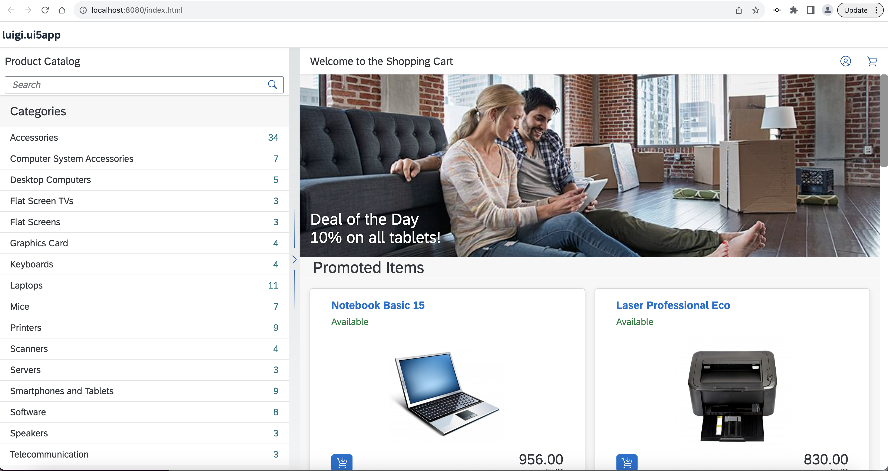
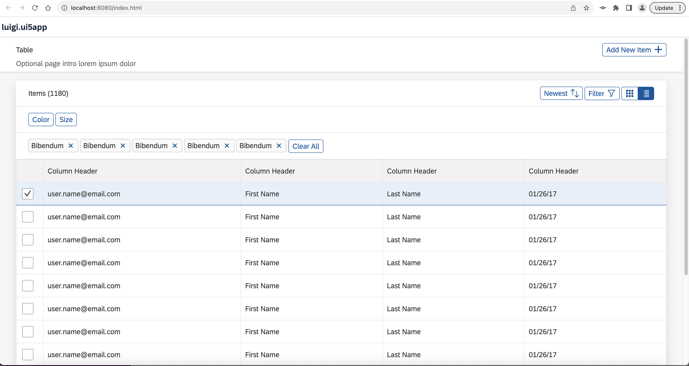

# Enable Micro Frontends in Your UI5 App Using Luigi Container
<!-- description --> Use the Luigi framework to create a sample application with Luigi Container micro frontends.

## Prerequisites
 - It is recommended to try the simpler examples on [GitHub](https://github.com/SAP/luigi/tree/master/core/examples) first to get familiarized with Luigi.
 - You need to have [Node.js](https://nodejs.org/en/download/current/) installed.
 - // TODO - any other requirements? 

## You will learn
  - The basics of the Luigi micro frontend framework and Luigi Container 
  - How to install Luigi Container
  - How to use Luigi Container inside a sample UI5 application

## Intro

[Project "Luigi"](luigi-project.io) is an open-source micro frontend framework suited for SAP environments which provides a Fiori-compliant navigation out-of-the-box. Luigi is technology-agnostic, which means you can create your app using any given frontend toolkit. 

Usually, Luigi consists of two main parts: **Luigi Core** and **Luigi Client**. Core refers to the main app which houses the micro frontends, while Client refers to the micro frontends themselves. 

**Luigi Container** allows you to easily insert Luigi micro frontends anywhere without the need for a Luigi Core application. This makes it easier for developers to use Luigi without having to make any big changes to their application. 

This tutorial will show you how to enable micro frontends inside a [UI5](https://sapui5.hana.ondemand.com/sdk/#/) application. However, the same process will also apply to other frontend frameworks such as [Angular](https://angular.io/) or [React](https://react.dev/).

> **NOTE:** In addition to this tutorial, you can also try out the Luigi Container test app on [GitHub](https://github.com/SAP/luigi/tree/main/container/test-app).

---

## Steps

### Install UI5 generator 

1. Open a new command prompt/terminal window and install the generator: 

`npm install -g yo generator-easy-ui5`

2. Verify your installation to see if Yeoman has been installed correctly: 

`yo`

Make sure you see the easy-ui5 generator listed.

### Create UI5 application 

1. Create your UI5 project:

`yo easy-ui5`

2. Answer the prompts to create your new project: 


3. Run the app locally:

```shell
cd <your project directory>
npm start # or "yarn start"
```

### Install Luigi Container 

Luigi Container can be installed via a [npm](https://www.npmjs.com/) package.

To use npm packages in UI5, you need to first install the UI5 Tooling.

1. In your project directory, run: 

```shell
npm i ui5-tooling-modules -D
```


2. Open your application's `ui5.yaml` file. At the end, add the UI5 tooling task and middleware declaration:

```yaml
specVersion: "3.0"
[...]
libraries:
    - name: sap.m
    - name: sap.ui.core
    - name: sap.ui.webc.common
    - name: themelib_sap_fiori_3
    - name: themelib_sap_horizon
builder:
  customTasks:
    - name: ui5-tooling-modules-task
      afterTask: generateVersionInfo
server:
  customMiddleware:
    - name: ui5-tooling-modules-middleware
      afterMiddleware: compression
    - name: ui5-middleware-livereload
      afterMiddleware: compression

```

3. Create a new folder called `control` in `luigi.ui5app/webapp`. In it, create a file called `LuigiContainer.js` and paste the following content into it: 

```javascript
// FIX to avoid issue in WebC wrapper (will be fixed soon!)
HTMLElement.prototype.attachInvalidate = function() {};

sap.ui.define([
    "sap/ui/webc/common/WebComponent",
    "@luigi-project/container"
], function(WebComponent) {
    "use strict";

    /**
     * Constructor for a new <code>LuigiContainer</code>.
     *
     * @param {string} [sId] ID for the new control, generated automatically if no ID is given
     * @param {object} [mSettings] Initial settings for the new control
     *
     * @extends sap.ui.webc.common.WebComponent
     * @class
     *
     * The <code>sap.me.shared.LuigiContainer</code> is a component to render a Luigi micro frontend (iframe or web component based) without the need of being a Luigi Core application.
     *
     * @author SAP SE
     *
     * @constructor
     * @public
     * @alias sap.me.shared.LuigiContainer
     */
    var LuigiContainer = WebComponent.extend("luigi.ui5app.control.LuigiContainer", {
        metadata: {
            tag: "luigi-container",
            properties: {
                /**
                 * Defines the view URL to load
                 */
                viewURL: {
                    type: "string",
                    defaultValue: "",
                    mapping: {
                        to: "viewURL"
                    }
                },

                /**
                 * Defines whether to load the Luigi component as web component
                 */
                webComponent: {
                    type: "any", // boolean, but WebComponentRenderer renders out boolean values as empty attributes, which we have to fix in our attribute formatter
                    defaultValue: false,
                    mapping: {
                        to: "webcomponent",
                        formatter: "_mapIsWebComponent"
                    }
                },

                /**
                 * Defines the height of the control
                 */
                height: {
                    type: "sap.ui.core.CSSSize",
                    mapping: "style"
                },

                /**
                 * Defines the width of the control
                 */
                width: {
                    type: "sap.ui.core.CSSSize",
                    mapping: "style"
                },

                /**
                 * Defines label of the Luigi component
                 */
                label: {
                    type: "string",
                    defaultValue: ""
                },

                /**
                 * Defines the context to use
                 */
                context: {
                    type: "object",
                    defaultValue: {}
                },

                theme: {
                    type: "string",
                    defaultValue: ""
                }
            },
            methods: ["updateContext", "sendCustomMessage", "closeAlert"]
        }
    });

    LuigiContainer.prototype._mapIsWebComponent = function(vIsWebComponent) {
        return vIsWebComponent !== "false" && vIsWebComponent ? "true" : undefined;
    };

    /**
     * Updates the context of the Luigi component by sending a message to the iFrame / Web Component that sets the context
     *
     * @public
     * @name sap.me.shared.LuigiContainer#updateContext
     * @param contextObj the context data
     * @param internal internal luigi legacy data
     * @function
    */

    /**
     * Send a custom message to the referenced iFrame or web component
     *
     * @public
     * @name sap.me.shared.LuigiContainer#sendCustomMessage
     * @param id the id of the event
     * @param data data to be sent alongside the custom message
     * @function
     */

    /**
     * Send a message to the Luigi component notifying the alert has been closed
     *
     * @public
     * @name sap.me.shared.LuigiContainer#closeAlert
     * @param id the id of the alert being closed
     * @param dismissKey the dismiss key being sent if any
     * @function
     */

    return LuigiContainer;
});
```

4. Go to `manifest.json` and add the following dependency:


Around line 33: 
```shell
"dependencies": {
[...]
				"sap.m": {},
				"sap.ui.webc.common": {}
```

5. Download the Luigi Container npm package: 

```shell
npm i @luigi-project/container
```

6. Go to `package-lock.json` and add the following dependencies:

```json
[...]
"name": "luigi.ui5app",
"version": "1.0.0",
"license": "Apache-2.0",
  "dependencies": {
// Around line 11, add: 
    "@luigi-project/container": "^1.0.0-rc5"
  },
"devDependencies": {
[...]
// Around line 23, add: 
"ui5-tooling-modules": "^3.0.0"
}
```

### Use Luigi Container 

1. Go to the `webapp/view/Main.view.xml` file of your UI5 application. 

2. Paste the following code in the file: 

```xml
<mvc:View
	controllerName="luigi.ui5app.controller.Main"
	displayBlock="true"
	xmlns="sap.m"
	xmlns:mvc="sap.ui.core.mvc"
	xmlns:core="sap.ui.core"
	xmlns:luigi="luigi.ui5app.control"
	core:require="{
		formatter: 'luigi/ui5app/model/formatter',
		core: 'sap/ui/core/Core'
	}">

	<Page
		title="{i18n>appTitle}"
		text="{i18n>appTitle}"
		icon="sap-icon://accept"
		id="page"
		description="{i18n>appDescription}">
		<content>
			<luigi:LuigiContainer viewURL="https://sapui5.netweaver.ondemand.com/test-resources/sap/m/demokit/cart/webapp/index.html " theme="{= core.getConfiguration().getTheme() }"/>
		</content>
	</Page>

</mvc:View>
```

This will enable you to embed the micro frontend with URL `https://sapui5.netweaver.ondemand.com/test-resources/sap/m/demokit/cart/webapp/index.html ` in your application. 

3. Run your application:

```shell
npm start
```

4. Open `http://localhost:8080/` in your browser. You should see the sample shopping app on your page: 



5. Now your application is using Luigi Container, and you can easily exchange micro frontends in order to create a modular, scalable app. To insert a different micro frontend, go to `webapp/view/Main.view.xml` and change the Luigi [viewURL](https://docs.luigi-project.io/docs/navigation-parameters-reference/?section=viewurl) property like so:  

```xml
[...]
<content>
			<luigi:LuigiContainer viewURL="https://fiddle.luigi-project.io/examples/microfrontends/fundamental/table-demo-page.html" theme="{= core.getConfiguration().getTheme() }"/>
		</content>
[...]
```

6. Open `http://localhost:8080/` in your browser. You should see the new micro frontend on your page: 

