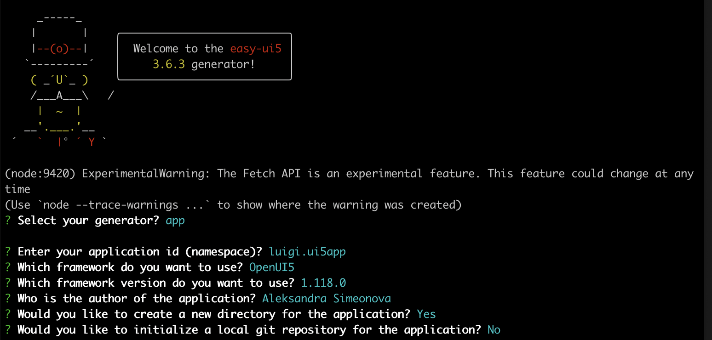

# Luigi SAP Developer Tutorial update

Tutorial parts:
1. [Create React app](#create-skeleton-react-app)  
2. [Create UI5 micro frontend](#create-skeleton-ui5-app) 
3. [Build Luigi app with React](#build-luigi-app-with-react)

## Create skeleton React app 

Link: https://developers.sap.com/tutorials/luigi-app-basic-setup.html

Steps: 

1. - create folder - ok
2. - create react app - ok

3. > ? :question: - npm eject - there is a problem here unless you set up a GitHub repository. React asks you to commit files to Git. 
    - How is this avoided in our [create React app script](https://github.com/SAP/luigi/blob/master/scripts/setup/react.sh)? 
    - https://stackoverflow.com/questions/65008696/how-to-create-react-app-without-git-skipping-git 
    - I tried `npx create-react-app react-core-mf --skip-git && cd react-core-mf` - it didn't work  
    - Should the user be instructed to create a new github repo just for this example? Is there an easier way? 

4. - dependencies - are they outdated? - e.g. `copy-webpack-plugin@5`

5. - replace strings - maybe it needs to be updated - it seems to still work 

6. create new folder - ok 

7. download react example - seems to work 

- perhaps add additional step here - run the app to check if it is ok? - when i try `npm start`, it opens the React start page.

8. Go back to root folder - ok 

## Create skeleton UI5 app 

Link: https://developers.sap.com/tutorials/luigi-app-basic-setup.html

Steps: 

1. Navigate to folder - ok
2. Create new folder - ok
3. UI5 generator npm install - it seems to run
4. > ? :question: Running `yo easy-ui5` throws an error: 

```bash
/usr/local/lib/node_modules/yo/node_modules/macos-release/index.js:27
	const [name, version] = nameMap.get(release);
	                        ^

TypeError: undefined is not iterable (cannot read property Symbol(Symbol.iterator))
    at macosRelease (/usr/local/lib/node_modules/yo/node_modules/macos-release/index.js:27:26)
    at osName (/usr/local/lib/node_modules/yo/node_modules/os-name/index.js:21:18)
    at new Insight (/usr/local/lib/node_modules/yo/node_modules/insight/lib/index.js:37:13)
    at Object.<anonymous> (/usr/local/lib/node_modules/yo/lib/cli.js:54:17)
    at Module._compile (node:internal/modules/cjs/loader:1155:14)
    at Object.Module._extensions..js (node:internal/modules/cjs/loader:1209:10)
    at Module.load (node:internal/modules/cjs/loader:1033:32)
    at Function.Module._load (node:internal/modules/cjs/loader:868:12)
    at Function.executeUserEntryPoint [as runMain] (node:internal/modules/run_main:81:12)
    at node:internal/main/run_main_module:22:47
```


The issue seems to be this one: https://github.com/yeoman/yo/issues/753 
After adding  [22, ["Ventura", "13"]], it works. 

Is there a way to avoid this issue? Another way to generate UI5 app? 

5. > ? :question: The UI5 generator has changed. It has different questions now. 
- This is what it looked like [before](https://developers.sap.com/tutorials/luigi-app-basic-setup/jcr:content.github-proxy.1644267916.file/ui5-yo.png). 
- I just guessed and entered these answers for the new questions, but I don't know if it's correct: 



6. > ? :question: Maybe 1 more step is needed - verify if ui5 app installed correctly? How can this be done? 

## Build Luigi app with React 

Link: https://developers.sap.com/tutorials/luigi-app-react.html 

Steps: 

1. 