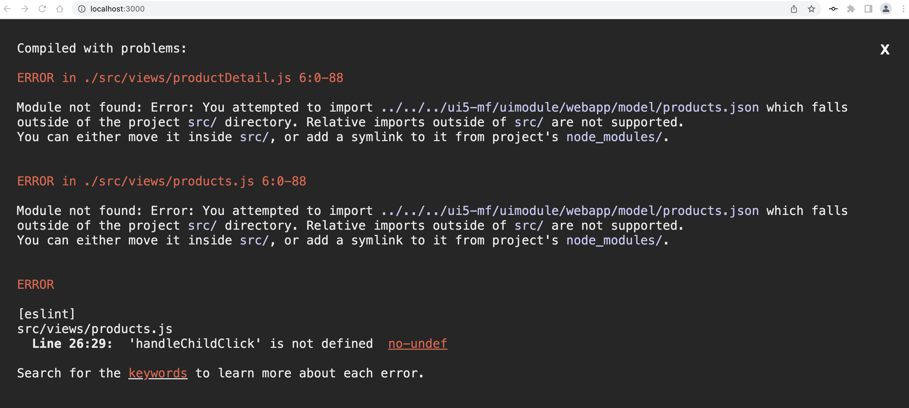

# Luigi SAP Developer Tutorial update

Tutorial parts:
1. [Create React app](#create-skeleton-react-app)  
2. [Create UI5 micro frontend](#create-skeleton-ui5-app) 
3. [Build Luigi app with React](#build-luigi-app-with-react)

## Create skeleton React app 

Link: https://developers.sap.com/tutorials/luigi-app-basic-setup.html

Steps: 

1. - create folder - ok
2. - create react app - ok

3. - npm eject - there is a problem here unless you set up a GitHub repository on some machines, see https://github.com/sap-tutorials/Tutorials/issues/6317

4. - dependencies - are they outdated? - e.g. `copy-webpack-plugin@5`

5. - replace strings - maybe it needs to be updated - it seems to still work 

6. create new folder - ok 

7. download react example - seems to work 

8. Go back to root folder - ok 

## Create skeleton UI5 app 

Link: https://developers.sap.com/tutorials/luigi-app-basic-setup.html

Steps: 

1. Navigate to folder - ok
2. Create new folder - ok
3. UI5 generator npm install - it seems to run
4. Running `yo easy-ui5` - ok

5. The UI5 generator has changed. It has different questions now. 
- This is what it looked like [before](https://developers.sap.com/tutorials/luigi-app-basic-setup/jcr:content.github-proxy.1644267916.file/ui5-yo.png). 
- I used [this example](https://blogs.sap.com/2022/03/10/easy-ui5-getting-started-even-easier/) to enter the following answers for the new questions: 

## Build Luigi app with React 

Link: https://developers.sap.com/tutorials/luigi-app-react.html 

Steps: 

1. Create `products.json` - ok 
2. Add Luigi to `index.html` - ok 
3. Create template - ok
4. > ? :question: Configure webpack - there is no 2nd occurrence of the line (around line 348) anymore. Is this correct, did something change in React? 
- React 18 is the new version, which may cause the changes 

5. Substep 2. -> There is no `react-core-mf/public/luigi-config.js` anymore? Should we ask the user to create it? 

6. Copy/paste files - ok 

7. - 9.  > ? :question: I did the steps (copy/pasting imports and configuration.) But in the end I get this error: 

- Seems like another change in React where it doesn't accept the imports anymore. 
- I can't figure out the `handleChildClick` error 

